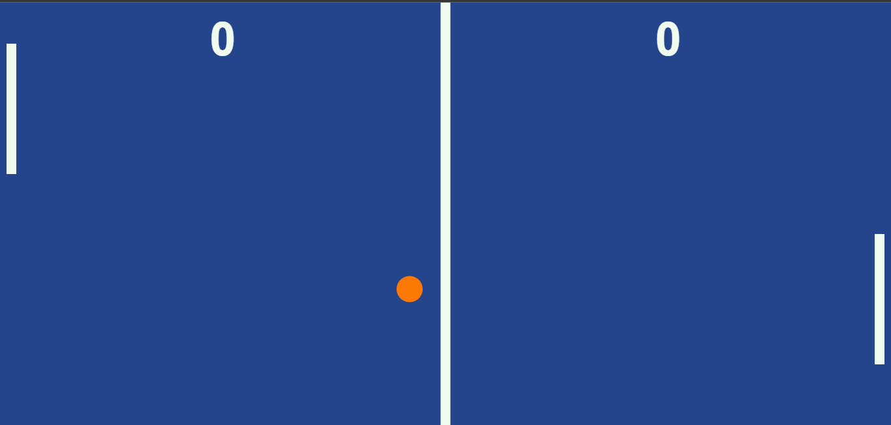

# PING-PONG
Este é um jogo de ping-pong simples feito com JavaScript e HTML Canvas. O jogo é para dois jogadores, um controla a raquete da esquerda e outro controla a raquete da direita. O objetivo do jogo é acertar a bola com a raquete e fazê-la passar pela raquete do adversário, marcando pontos.
<br>
<br>


# Principais Funcionalidades
- Dois jogadores (você e o computador)
- Placar para registrar os pontos de cada jogador
- Raquetes do mesmo tamanho
- Bola de tamanho fixo
- Velocidade da bola e do computador aumenta a cada ponto marcado

# Tecnologias Utilizadas
- HTML5 (canvas)
- CSS3
- JavaScript

# Estrutura do jogo
A estrutura do jogo é baseada em um conjunto de objetos e funções JavaScript: <br>
<br>
<br>
**Objetos:** 
- **field:** representa o campo de jogo.
- **line:** representa a linha central do campo de jogo.
- **leftPaddle:** representa a raquete esquerda controlada pelo jogador.
- **rightPaddle:** representa a raquete direita controlada pelo computador.
- **score:** mantém a pontuação do jogo.
- **ball:** representa a bola no jogo.
<br>

**Funções:**
<br>
- A função **setup()** configura o tamanho do canvas onde o jogo será desenhado, enquanto a função **draw()** desenha os elementos do jogo na tela, como o campo, as linhas, as raquetes, a bola e a pontuação.

- A função **animateFrame()** é uma função auxiliar que ajuda a deixar a animação mais suave, permitindo que o jogo seja executado em diferentes navegadores com diferentes implementações de animação.

- A **função main()** chama a função **animateFrame()** para executar continuamente o jogo e chama a função **draw()** para atualizar o desenho dos elementos na tela.

# Como jogar
- Mova sua raquete com o mouse.
- O objetivo é marcar pontos acertando a bola e fazendo ela passar pela raquete do adversário.
- O jogo termina quando um dos jogadores marcar 10 pontos.
- Para jogar novamente após o jogo terminar, é só atualizar a página.
- O jogo é responsivo e se adapta a diferentes tamanhos de tela.


# Utilização

Para jogar na sua máquina siga os seguintes passos:

- Clone o repositório para sua máquina local utilizando o seguinte comando:
```bash
  git clone https://github.com/ViniciusQuintas/PING-PONG.git
```
- Após clonar o repositório, navegue até o diretório PING-PONG no terminal:
```bash
  cd PING-PONG
```
- Agora, abra o arquivo index.html no seu navegador para jogar. Se divirta!

# Personalização do jogo
Você pode personalizar a aparência e o comportamento do jogo ajustando as variáveis do JavaScript no arquivo script.js. Aqui estão algumas das variáveis que você pode ajustar:
- **field:** A cor do campo.
- **line:** A cor e o tamanho da linha.
- **gapX:** A distância entre as raquetes e a borda do campo.
- **leftPaddle:** A configuração da raquete da esquerda, incluindo a posição inicial, tamanho e velocidade.
- **rightPaddle:** A configuração da raquete da direita, incluindo a posição inicial, tamanho e velocidade.
- **score:** A configuração do placar, incluindo o número de pontos necessários para vencer.
- **ball:** A configuração da bola, incluindo a posição inicial, tamanho, cor e velocidade.

# Contribuição
Se você deseja contribuir para o desenvolvimento e correção de bugs desse jogo, siga os seguintes passos:

1️⃣ Faça um fork deste repositório. 
<br>
<br>
2️⃣ Crie uma nova branch para sua contribuição. 
<br>
<br>
3️⃣ Faça as alterações que desejar no código. 
<br>
<br>
4️⃣  Certifique-se de que suas alterações não vão quebrar o funcionamento já existente do jogo. 
<br>
<br>
5️⃣ Faça um pull request com suas alterações. 
<br>
<br>

# Licença
Este projeto está licenciado sob a Licença MIT. Consulte o arquivo LICENSE para obter mais informações.
